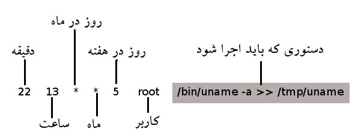

در بخش اول، فرمان‌های sleep و at رو توضیح دادم، و در این بخش، به معرفی cron، یکی از قدرتمندترین ابزارهای زمان‌بندی خواهم پرداخت.

<span class="more"></span>

## Cron چیست؟ ##

Cron یک Daemon است که وظایفی رو که از طریق دستور crontab دریافت می‌کنه، در زمان‌های مشخص‌شده اجرا 
می‌کنه. در واقع کار cron اینه که هر دقیقه بیدار شه و بررسی کنه که آیا در crontab کاربرهای مختلف کاری (cron-job) هست که انجام بده؟

(توجه کنید که crontab هم نام لیستی از cron-jobهاست و هم نام فرمانی که از طریق آن لیست کارها مشخص و ویرایش می‌شود.)

به عنوان مثال ممکنه یک پدر قصد داشته باشه دسترسی به اینترنت رو هر شب ساعت ۹ قطع کنه. و یا اینکه یک مدیر بخواد دسترسی به نرم‌افزارهای مسنجر رو در طی ساعات کاری برای کارمنداش غیر ممکن کنه. و یا اینکه ممکنه کسی بخواد در زمانی که جلوی سیستمش حضور نداره، یک سری از لاگ‌های سیستم روزی یک بار براش ایمیل بشه.

## فایل ‭/etc/crontab‬ ##

Cron تمام این کارها رو از طریق بررسی فایل‌های تنظیمات خاصش به نام crontabها انجام می‌ده. به این معنی 
که ما باید crontabها رو تنظیم کنیم تا cron محتویات اون‌ها رو بررسی و دستورات درون آن‌ها رو در زمان مشخص شده انجام بده. اولین و مرسوم‌ترین فایل تنظیمات `‭/etc/crontab‬` است. هر سطر دستور در این فایل از یک الگوی کلی به شکل زیر پیروی می‌کنه:

[](./crontab-persian.jpg)

دقیقه عددی بین ۰ و ۵۹، ساعت بین ۰ تا ۲۳ و روز در ماه بین ۱ تا ۳۱ می‌باشد. در مورد ماه و روز هفته هم می‌شه از سه حرف اول روز یا ماه استفاده کرد مثل: feb, jan, mon, wed و هم می‌شه از اعداد استفاده کرد. (یکشنبه: ۰، دوشنبه: ۱ تا آخر)

در هر یک از ستون‌های مربوط به زمان یکی از حالت‌های زیر ممکنه نوشته بشه:

- \* به معنی هر زمانی (مثلا گذاشتن * در ستون دقیقه یعنی تمام دقایق)
- یک عدد
- چند عدد که با کاما جدا شده اند. (5,7,13)
- یک بازه (5-10)
- یک بازه به همراه پله ( 20/2-10 = 10, 12, 14, 16, 18, 20 و 5/* یعنی 5, 10, 15, ...)

به عنوان مثال دو سطر زیر رو در نظر بگیرید:

```bash
*/10  *     *  5,7,11  *    root command1
0     9-18  *  *       1-5  root command2
```

در سطر اول در ماه‌های می، جولای و نوامبر هر ده دقیقه `command1` اجرا می‌شه. در سطر دوم هم `command2` در روزهای دو‌شنبه تا جمعه و در ساعات ۹ صبج تا ۶ بعد از ظهر هر ساعت اجرا می‌شه.


## run-parts: ##

با اینکه زمان‌بندی دستورات توسط فایل `‭/etc/crontab‬` یک کار کاملا عملی‌است، اکثر توزیع‌های لینوکس در حال حاضر از اسکریپتی به نام run-parts برای اجرای دستورات استفاده می‌کنن. به عنوان مثال یک نمونه از فایل /etc/crontab در توزیع fedora رو ببینید:

```bash
01 * * * * root run-parts /etc/cron.hourly
02 4 * * * root run-parts /etc/cron.daily
22 4 * * 0 root run-parts /etc/cron.weekly
42 4 1 * * root run-parts /etc/cron.monthly
```

درواقع کاری که اسکریپت run-parts می‌کنه اینه که اسکریپت‌های قابل اجرا رو در یک فولدر اجرا می‌کنه. مثلا اگر شما قصد داشته باشید که اسکریپتتون هفته‌ای یک بار اجرا بشه، فقط کافیه اون رو توی فولدر /etc/cron.weekly/ کپی کنید.
استفاده از این روش خیلی راحته اما، دیگه امکان زمانبندی دقیق وجود نداره و طبیعتا با این‌روش نمی‌شه هر شب ساعت ۹ اینترنت رو قطع کرد و صبح وصلش کرد.

## Cron برای همه: ##

نیازی به این نیست که برای همه‌ی دستورها از `‭/etc/crontab‬` و کاربر ریشه استفاده کرد. هر کاربر دیگه‌ای هم می‌تونه یک فایل `crontab` مخصوص به خودش داشته باشه و دستوراتی رو که اجازه‌ی اجراشون رو داره، به وسیله‌ی این فایل زمان‌بندی کنه. این فایل معمولا در فولدر `‭/var/spool/cron/crontab/‬` و به نام کاربر ذخیره می‌شه و فرمتش هم مثل `‭/etc/crontab‬` است با این تفاوت که ستون کاربر وجود نداره.

البته کاربرها اجازه‌ی ویرایش مستقیم فایل `crontab` خودشون رو ندارن و برای اینکار باید از دستور `crontab -e` استفاده کنن.
کاربر ریشه می‌تونه تعیین کنه که کدام کاربرها حق استفاده از دستور `crontab` رو داشته باشن. این کار با استفاده از دو فایل `‭/etc/cron.allow‬` و `‭/etc/cron.deny‬` انجام می‌شه و همینطور که از نام فایل‌ها پیداست، 
اگر اسم یک کاربر در فایل `‭/etc/cron.allow‬` باشه اون کاربر اجازه‌ی دسترسی به `crontab` رو داره و 
اگر اسم کاربر در `‭/etc/cron.deny‬` باشه اون کاربر اجازه‌ی دسترسی به `crontab` رو نداره. البته مسلما بعد از انجام تغییرات در این فایل‌ها، باید یک بار logout و دوباره login کنید تا تغییرات اعمال بشه.

## چند نکته‌: ##
دستوراتی که به cron می‌دین بهتره که شامل محل دقیق دستور باشه چرا که cron فقط توی شاخه‌های `/usr/bin/` و `/bin/` به دنبال دستورها می‌گرده.

همین‌طور معمولا خروجی استاندارد و ارورهای یک دستور رو به یک فایل redirect می‌کنن تا بعدا بشه خروجی رو دید:

```bash
15 6 * * * /usr/bin/someprog > /tmp/someprog.out 2>&1
```

الان زمان اون رسیده که خودتون cron رو امتحان کنید و ببینید چه کارایی ازش بر میاد.

**قسمت اول:** [زمان‌بندی پروسه‌ها در لینوکس - بخش اول، فرمان‌های at و sleep](/articles/20101214_scheduling-processes-with-at-and-sleep/)

