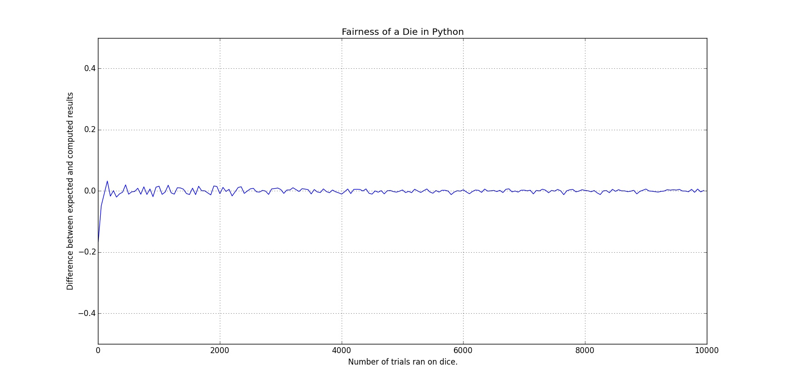
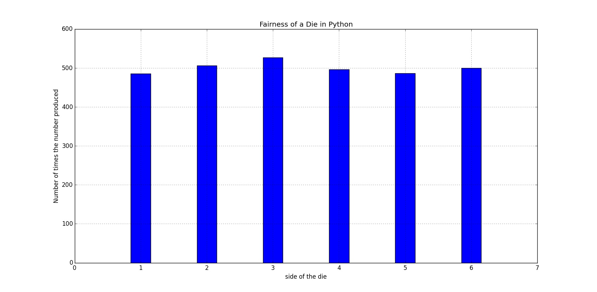
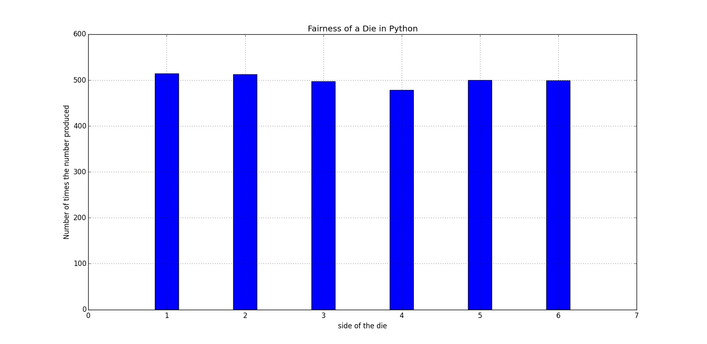

بازی‌هایی که در اون‌ها از تاس استفاده می‌شه معمولا تا حد زیادی به شانس
بستگی داره. افراد مختلف تعاریف مختلفی از شانس دارن، عده‌ای سعی می‌کنن که
با تمرکز روی یک عدد یا دعا کردن شانس خودشون رو برای ریختن تاس مناسب
افزایش بدن و عده‌ای هم به روش‌های مختلف دست به تقلب می‌زنن. اما ریاضیات
تعریف متفاوتی از شانس داره. ریاضیات، شانس رو «اندازه‌ی احتمالِ وقوعِ یک
رویداد» تعریف می‌کنه که با یک عدد بین ۰ و ۱ نمایش داده می‌شه و همون‌طور
که می‌دونین در مبحث
[احتمالات](http://fa.wikipedia.org/wiki/%D8%A7%D8%AD%D8%AA%D9%85%D8%A7%D9%84%D8%A7%D8%AA)
بررسیش می‌کنه.

<span class="more"></span>

از اونجا که ایده‌ی تاس اینه که ما به یک روشی یک عدد تصادفی بین ۱ تا ۶
انتخاب کنیم، من این کار رو به راحتی با استفاده از ماژول random در پایتون
شبیه‌سازی می‌کنم تا بتونم بعدا بررسیش کنم:

```python
import random


def roll_die(num_sides, true_random=False):
    '''simulates rolling a die, if true_random is set, it will use random.org
    to produce true random numbers. be careful though, it might take a lot
    of time and the difference is really not that much.'''
    if true_random is True:
        import randomdotorg
        r = randomdotorg.RandomDotOrg('alimsvi.ir')
        return r.randrange(1, num_sides + 1)
    return random.randrange(1, num_sides + 1)
```

بر اساس چیزی که ریاضیات می‌گه، فرض کنید ما یک تاس عادلانه‌ی ۶ وجهی داشته
باشیم که روی هر وجه اون یکی از اعداد بازه‌‌ی از ۱ تا ۶ نوشته شده باشه.
هر عددی رو که در این بازه در نظر بگیریم و تاس رو بریزیم، احتمال این که
عدد مورد نظر ما بیاد $\frac{1}{6}$ است.

یک روش امتحان کردن این مساله می‌تونه به این صورت باشه که ما بارها تاس
مورد نظرمون رو بریزیم و انتظار داشته باشیم که میانگین دفعاتی که تاس مورد
نظرمون ریخته شده نزدیک به $\frac{1}{6}$ باشه. و این یعنی اگر میانگین رو
M در نظر بگیریم، اختلاف M با عدد $\frac{1}{6}$ باید نزدیک به صفر باشه.

از اونجایی که من حوصله ندارم یک تاس رو «بارها» بریزم و نتیجه‌ها رو
یادداشت کنم و در آخر میانگین مورد نظرم رو بررسی کنم، چند خط کد پایتون
می‌نویسم و این مساله رو با یک نمودار بررسی می‌کنم:

```python
def plot_fairness_line(num_sides, max_trials, step, side):
    '''tests the difference between expected average and the real average
    produced after rolling a die for a range of trials.'''
    diff_data = []
    num_trials_data = []
    for num_trials in range(1, max_trials, step):
        side_count = 0
        for dummy_idx in range(num_trials):
            result = roll_die(num_sides)
            if result == side:
                side_count += 1

        statistical_prb = 1.0 / 6
        computed_prb = side_count / float(num_trials)
        diff_data.append(computed_prb - statistical_prb)
        num_trials_data.append(num_trials)

    pyplot.plot(num_trials_data, diff_data)
    pyplot.xlabel("Number of trials ran on dice.")
    pyplot.ylabel("Difference between expected and computed results")
    pyplot.grid(True)
    pyplot.ylim((-0.5, 0.5))
    pyplot.title("Fairness of a Die in Python")
    pyplot.show()

plot_fairness_line(6, 10000, 10, 2)
```

نموداری که با اجرای این کد نمایش داده می‌شه مشخص می‌کنه که هر چه تاس
بیشتری ریخته شده اختلاف میانگین با $\frac{1}{6}$ بیشتر به صفر نزدیک شده:

[](./die_probability_1.jpeg)

برای این که مفهوم‌تر بشه، قضیه رو یک جور دیگه امتحان می‌کنیم. فرض کنید
تاس رو ۳۰۰۰ بار بریزیم، با توجه به این که $\frac{1}{6} * 3000=500$،
می‌تونیم انتظار داشته باشیم که هر یک از اعداد روی تاس حدوداً ۵۰۰ بار
ریخته بشن. بنابراین می‌تونیم چند خط کد دیگه بنویسم که ۳۰۰۰ بار تابع ما
رو اجرا کنه، اعدادی رو که ریخته می‌شن بشمره و در نهایت نتیجه رو در یک
نمودار دیگه بررسی کنیم:

نمودار به دست اومده این مساله رو تایید می‌کنه:

[](./die_probability_2.jpeg)

## نتیجه‌

این نتایج نشون می‌ده که در مقیاس بزرگ‌تر و زمانی که تعداد دفعات انجام یک
فرایند تصادفی زیاد بشه، نتیجه‌ی به دست اومده خیلی شانسی نیست. یعنی هر چه
تعداد دفعات ریختن تاس ما به بی‌نهایت میل کنه، نتیجه‌ی به دست آمده
مشخص‌تر می‌شه. این مساله رو به خیلی چیزها می‌شه بسط داد و استفاده‌های
زیادی در علوم مختلف داره، که تفسیرش با شما و علم مورد نظرتون.

## ویرایش

[مهدی](http://ataeyan.com/) توی فیس‌بوک برای من نوشته:

> یک نکته توی کامپیوتر چیزی به نام تولید اعداد صد درصد تصادفی نداریم.
> یعنی تو اگه یک سیستم بسته داشته باشی (مثل همین کامپیوترت) اعدادی که
> تصادفی تولید میشه در حقیقت تصادفی نیستند! و اگه آزمایشت رو بی‌نهایت
> تکرار کنی میتونی این تصادفی نبودن رو کشف کنی. راه‌حلش هم استفاده از
> سرویس‌هایی مثل [random.org](http://random.org) اه که اونها هم روشهای
> خاص خودشون رو دارن برای تولید اعداد رندوم (مثلا از امواج کیهانی
> استفاده می‌کنن)

برای امتحان حرف مهدی، من کد توابع رو توی پست عوض کردم و همین‌طور که
می‌بینید به تابع roll\_die یک آرگومان جدید اضافه کردم که در صورت استفاده
ازش، با استفاده از ماژول
[randomdotorg](https://pypi.python.org/pypi/randomdotorg/) از طریق
وبسایت مذکور اعداد تصادفی واقعی به دست بیاد و این رو در تابع
plot\_fairness\_bar اعمال کردم و با خط زیر امتحانش کردم:

```python
plot_fairness_bar(6, 3000, true_random=True)
```

طبیعتا مدت زیادی طول کشید تا ۳۰۰۰ عدد تصادفی از طریق وبسایت random.org
تولید بشه و با سرعت و کیفیت بالای اینترنت اینجا، به دست من برسه. ولی
نتیجه‌ی نهایی نمودار زیر شد:

[](./die_probability_3.jpeg)

همون‌طور که می‌بینید تفاوت آن‌چنانی با الگوریتم ماژول random پایتون وجود
نداره و من فکر می‌کنم در مواردی که ما لازم داریم می‌شه با خیال راحت از
روش سریع‌تر پایتون استفاده کرد.
